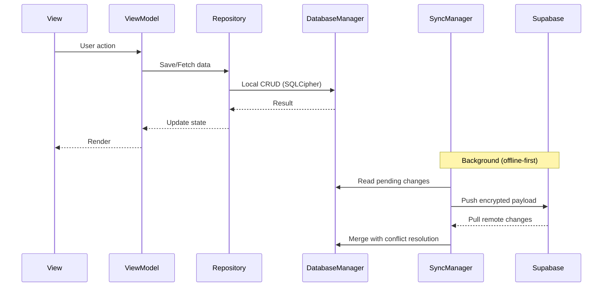
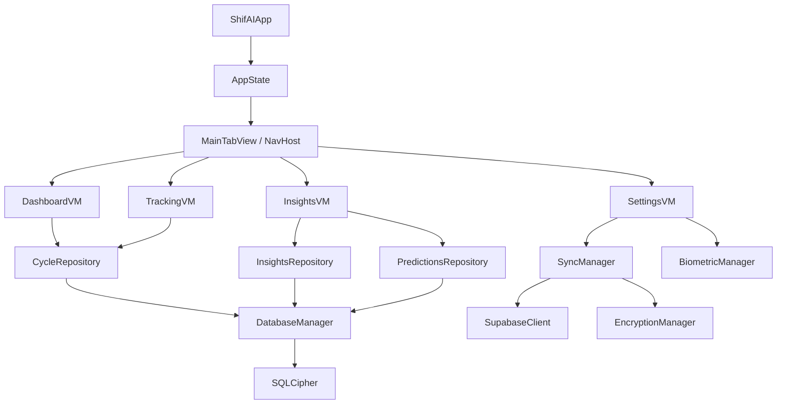

# Architecture — ShifAI

## Overview

ShifAI is a cross-platform menstrual cycle tracking app built with **SwiftUI** (iOS) and **Jetpack Compose** (Android), backed by **Supabase** (PostgreSQL + Edge Functions).

## Architecture Pattern

**MVVM + Repository + Domain Engines**

```
┌─────────────────────────────────────────────┐
│                 UI Layer                     │
│  SwiftUI Views / Compose Screens            │
├─────────────────────────────────────────────┤
│              ViewModels (7)                  │
│  Dashboard, Tracking, DetailTracking,       │
│  Insights, Export, Settings, Onboarding     │
├─────────────────────────────────────────────┤
│             Domain Engines                   │
│  MLEngine, RuleEngine, PatternDetection,    │
│  QuickWinEngine, MedicalExport, Notif       │
├─────────────────────────────────────────────┤
│            Repository Layer                  │
│  CycleRepository, InsightsRepository,       │
│  PredictionsRepository                      │
├─────────────────────────────────────────────┤
│             Data Layer                       │
│  DatabaseManager, SyncManager, Supabase,    │
│  EncryptionManager, HealthKit/HC            │
├─────────────────────────────────────────────┤
│           Infrastructure                     │
│  CrashReporter, PerformanceMonitor,         │
│  AnalyticsTracker, NetworkReachability      │
└─────────────────────────────────────────────┘
```

## Platform Mapping

| Component | iOS | Android |
|-----------|-----|---------|
| UI Framework | SwiftUI | Jetpack Compose |
| State Management | @MainActor + @Published | StateFlow + ViewModel |
| Local DB | GRDB + SQLCipher | Room + SQLCipher |
| Keychain | Keychain Services | Android Keystore |
| Encryption | CryptoKit (AES-256-GCM) | javax.crypto + Keystore |
| Background Sync | BGTaskScheduler | WorkManager |
| Biometric Auth | LocalAuthentication | BiometricPrompt |
| Health Data | HealthKit | Health Connect |
| Widgets | WidgetKit | Glance |
| Network Monitor | NWPathMonitor | ConnectivityManager |
| Push Notifications | UNNotification | NotificationChannel |
| Performance | OSLog / signpost | SystemClock |
| Haptics | UIImpactFeedbackGenerator | Vibrator |

## Data Flow



## Security Architecture

```
User Data → AES-256-GCM Encryption → SQLCipher DB (local)
                ↕
         Background Sync
                ↕
Encrypted Payload → TLS 1.3 + Cert Pinning → Supabase (EU)
                                                  ↕
                                          RLS (Row Level Security)
                                          pgcrypto (at rest)
```

- **Zero-knowledge**: Server cannot read user data
- **Key storage**: iOS Keychain / Android Keystore (hardware-backed)
- **Certificate pinning**: Domain-specific pins for API calls

## Backend Architecture

```
Supabase Project
├── PostgreSQL + RLS Policies
├── Edge Functions (Deno)
│   ├── sync-data         → Batch encrypted sync
│   ├── generate-share-link → Time-limited medical sharing (72h)
│   ├── delete-account    → GDPR account deletion
│   ├── cleanup-expired   → Cron: links, storage, conflicts
│   └── cleanup-expired-exports → Export file cleanup
└── Storage (encrypted blobs)
```

## Module Dependencies


