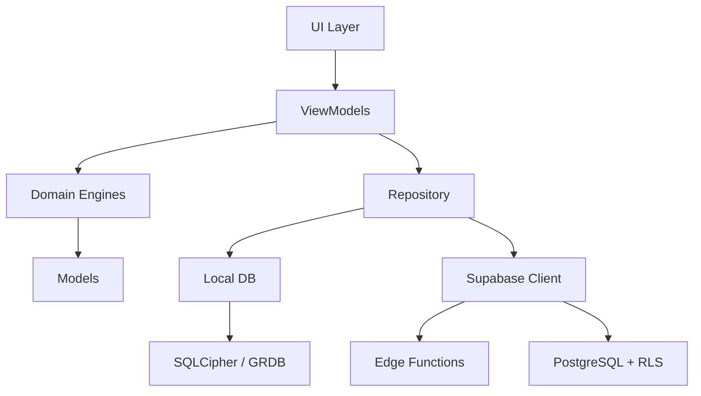

# ShifAI 🌙

**Suivi de cycle menstruel intelligent** — privacy-first, AI-powered, offline-ready.

[](shifai-ios/)
[](shifai-android/)
[](.github/workflows/ci.yml)
[](LICENSE)

## Architecture

```
shifai-ios/          SwiftUI · GRDB · CryptoKit · WidgetKit
shifai-android/      Compose · Room · Keystore · Glance
shifai-backend/      Supabase · PostgreSQL · Deno Edge Functions
.github/             CI/CD · Issue Templates · CODEOWNERS
```

### Layer Diagram



## Features

| Feature | Description |
|---------|-------------|
| 📊 **Smart Tracking** | Flow, mood, energy, sleep, stress, 29 symptom types, body map |
| 🤖 **AI Predictions** | Rule-based → ML transition after 6 cycles (CoreML / TFLite) |
| 💡 **Pattern Insights** | Correlations, trends, personalized quick wins |
| 📄 **Medical Export** | PDF reports (SOPK, Endométriose, Custom) + CSV |
| 🔒 **Zero-Knowledge** | AES-256-GCM E2E encryption, data unreadable on server |
| ☁️ **E2E Sync** | Offline-first with encrypted cloud backup |
| 📱 **Widgets** | iOS WidgetKit + Android Glance with privacy mode |
| 🔔 **Smart Alerts** | Phase predictions, quiet hours, per-category control |
| ♿ **Accessible** | WCAG 2.1 AA, French semantic labels |
| 🇫🇷 **French-First** | Full French UI (150+ strings per platform) |

## Quick Start

### Prerequisites
- **iOS**: Xcode 15+, Swift 5.9+
- **Android**: Android Studio Hedgehog+, JDK 17
- **Backend**: Deno 1.40+, Supabase CLI

### Setup

```bash
git clone https://github.com/shifai/shifai.git && cd shifai

# Backend
cd shifai-backend && supabase start && supabase db reset

# iOS
open shifai-ios/ShifAI.xcodeproj
# Set SUPABASE_URL and SUPABASE_ANON_KEY in Config.xcconfig

# Android
cd shifai-android && ./gradlew assembleDebug
# Set values in local.properties
```

### Run Tests

```bash
# iOS (200+ tests)
cd shifai-ios && fastlane test

# Android (250+ tests)
cd shifai-android && ./gradlew testDebugUnitTest

# Backend (13 tests)
cd shifai-backend && deno test supabase/functions/tests/
```

## Security & Privacy

> ShifAI processes **health data** (GDPR Article 9). Security is not optional.

- 🔐 **AES-256-GCM** encryption at rest (SQLCipher) and in transit (TLS 1.3)
- 🔑 **Keychain / Keystore** for cryptographic keys
- 📌 **Certificate pinning** for API calls
- 🚫 **Zero third-party trackers** — Plausible analytics only (consent-based)
- 🏛️ **EU-only hosting** (aws-eu-central-1)
- 📋 **DPIA** completed (RGPD Art. 35)

See [SECURITY_AUDIT.md](SECURITY_AUDIT.md) for the full 50+ item checklist.

## Documentation

| Document | Purpose |
|----------|---------|
| [CONTRIBUTING.md](CONTRIBUTING.md) | Architecture rules, code style, PR process |
| [ANALYTICS_EVENTS.md](ANALYTICS_EVENTS.md) | 22 privacy-safe events |
| [PRIVACY_POLICY.md](PRIVACY_POLICY.md) | RGPD-compliant (French) |
| [TERMS_OF_SERVICE.md](TERMS_OF_SERVICE.md) | App Store / Play Store |
| [DPIA.md](DPIA.md) | Data Protection Impact Assessment |
| [SECURITY_AUDIT.md](SECURITY_AUDIT.md) | Pre-launch security checklist |
| [CHANGELOG.md](CHANGELOG.md) | Release notes |

## License

Proprietary. All rights reserved.
# Shifai2
