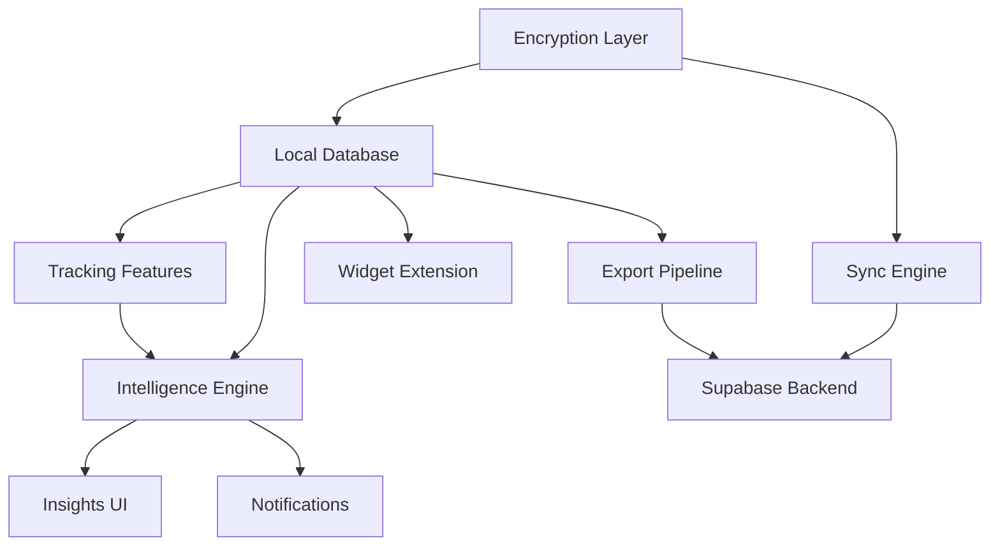

# Architecture Decision Document — ShifAI

_Comprehensive technical architecture for ShifAI: Mobile native (Swift iOS + Kotlin Android) with Privacy-First encrypted backend, on-device ML, and offline-first sync._

---

## 1. System Overview

### High-Level Architecture

```
┌─────────────────────────────────────────────────────────────────────┐
│                        UTILISATRICES                                │
│                                                                     │
│  ┌─────────────┐  ┌──────────────┐  ┌──────────────┐               │
│  │  iOS App    │  │ Android App  │  │  Widgets     │               │
│  │  (Swift)    │  │  (Kotlin)    │  │  iOS/Android │               │
│  └──────┬──────┘  └──────┬───────┘  └──────┬───────┘               │
│         │                │                  │                       │
│  ┌──────┴────────────────┴──────────────────┴───────┐              │
│  │          LOCAL ENCRYPTED STORAGE                   │              │
│  │  ┌───────────┐  ┌──────────┐  ┌────────────────┐ │              │
│  │  │ SQLCipher │  │ Keychain │  │ On-Device ML   │ │              │
│  │  │ (AES-256) │  │/Keystore │  │ (CoreML/TFLite)│ │              │
│  │  └───────────┘  └──────────┘  └────────────────┘ │              │
│  └──────────────────────┬───────────────────────────┘              │
│                         │ Encrypted Sync (opt-in)                   │
└─────────────────────────┼───────────────────────────────────────────┘
                          │ TLS 1.3 + Certificate Pinning
┌─────────────────────────┼───────────────────────────────────────────┐
│                    CLOUD (EU ONLY)                                   │
│  ┌──────────────────────┴────────────────────────────┐              │
│  │              Supabase EU Region                    │              │
│  │  ┌───────────┐  ┌──────────┐  ┌────────────────┐ │              │
│  │  │ PostgreSQL│  │  Auth    │  │  Storage       │ │              │
│  │  │ (encrypted│  │ (OAuth2) │  │  (Export PDFs) │ │              │
│  │  │  blobs)   │  │          │  │                │ │              │
│  │  └───────────┘  └──────────┘  └────────────────┘ │              │
│  └───────────────────────────────────────────────────┘              │
│                                                                     │
│  ┌────────────────┐  ┌──────────────────────────────┐              │
│  │ Plausible      │  │  Edge Functions              │              │
│  │ Analytics      │  │  (Sync API, Export Gen)      │              │
│  │ (privacy)      │  │                              │              │
│  └────────────────┘  └──────────────────────────────┘              │
└─────────────────────────────────────────────────────────────────────┘
```

### Architecture Principles

| # | Principe | Rationale |
|---|----------|-----------|
| P1 | **Offline-First** | Données locales = source de vérité. Cloud sync optionnel. |
| P2 | **Zero-Knowledge** | Le serveur ne peut jamais lire les données en clair. |
| P3 | **Privacy-by-Design** | Chiffrement E2E, pas de trackers, GDPR natif. |
| P4 | **Native-First** | Performances, widgets, sécurité hardware (Keychain/Keystore). |
| P5 | **Progressive Intelligence** | Règles heuristiques J1 → ML personnalisé J14+. |
| P6 | **Boring Technology** | Stack éprouvé, minimiser les risques d'innovation technique. |

---

## 2. Starter Template & Platform Strategy

### Platform Decision: Native iOS + Android

**Choix :** Swift (iOS) + Kotlin (Android) natif — pas de cross-platform.

**Rationale :**
- **Sécurité P0** : Accès direct Keychain/Secure Enclave (iOS), Keystore/TEE (Android)
- **Widgets critiques** : WidgetKit (iOS) et Glance API (Android) = expérience native obligatoire
- **Performance ML** : Core ML (iOS), TensorFlow Lite (Android) optimisés nativement
- **Biométrie** : LocalAuthentication (iOS), BiometricPrompt (Android)

**Velocity Risk Mitigation (du PRD) :**
- iOS = North Star platform M1-6 (toutes features polies)
- Android = 80% parity target M6
- Si vélocité issues M4-5 → Android full parity shift à M7-9
- Feature flags pour gérer la divergence entre plateformes

### Initialization

**iOS :**
```
Xcode project (Swift, SwiftUI + UIKit hybrid)
- Minimum deployment target: iOS 16.0
- Swift 5.9+
- SwiftUI pour UI, UIKit pour composants complexes (Body Map)
```

**Android :**
```
Android Studio project (Kotlin, Jetpack Compose + legacy Views)
- Minimum SDK: 26 (Android 8.0)
- Target SDK: 34 (Android 14)
- Kotlin 2.0+
- Jetpack Compose pour UI, Views pour Body Map canvas
```

---

## 3. Core Architectural Decisions

### 3.1 Data Architecture

#### 3.1.1 Local Database: SQLCipher

| Aspect | Décision |
|--------|----------|
| **Engine** | SQLCipher (SQLite chiffré AES-256-CBC) |
| **iOS** | GRDB.swift + SQLCipher Community Edition |
| **Android** | Room + SQLCipher for Android |
| **Rationale** | Chiffrement transparent, SQLite battle-tested, pas de overhead |

**Schéma simplifié :**

```sql
-- Toutes les tables sont dans une DB chiffrée par SQLCipher
-- La clé de chiffrement dérive de biometric/PIN

CREATE TABLE user_profile (
    id TEXT PRIMARY KEY,         -- UUID
    created_at INTEGER,          -- Unix timestamp
    onboarding_completed INTEGER,
    cycle_type TEXT,             -- 'regular', 'irregular', 'unknown'
    conditions TEXT,             -- JSON: ['sopk', 'endo', ...]
    preferences TEXT             -- JSON: notification settings, etc.
);

CREATE TABLE cycle_entries (
    id TEXT PRIMARY KEY,
    date TEXT NOT NULL,           -- ISO 8601 date (YYYY-MM-DD)
    flow_intensity INTEGER,      -- 1-5, NULL if no period
    cycle_day INTEGER,
    phase TEXT,                  -- 'menstrual', 'follicular', 'ovulatory', 'luteal'
    created_at INTEGER,
    updated_at INTEGER,
    sync_status TEXT DEFAULT 'pending'  -- 'pending', 'synced', 'conflict'
);

CREATE TABLE symptom_logs (
    id TEXT PRIMARY KEY,
    date TEXT NOT NULL,
    symptom_type TEXT NOT NULL,   -- 'mood', 'energy', 'sleep', 'stress', 'pain', ...
    value INTEGER,               -- 1-10 scale
    notes TEXT,                  -- Free text
    body_zone TEXT,              -- NULL or 'uterus', 'left_ovary', 'right_ovary', 'lower_back', 'thighs'
    pain_type TEXT,              -- NULL or 'cramping', 'burning', 'pressure', 'other'
    created_at INTEGER,
    updated_at INTEGER,
    sync_status TEXT DEFAULT 'pending'
);

CREATE TABLE insights (
    id TEXT PRIMARY KEY,
    date TEXT NOT NULL,
    type TEXT NOT NULL,           -- 'quick_win', 'pattern', 'prediction', 'recommendation'
    title TEXT,
    body TEXT,                   -- Markdown content
    confidence REAL,             -- 0.0-1.0
    reasoning TEXT,              -- Explainable AI: pourquoi cette prédiction
    source TEXT,                 -- 'rule_based', 'ml_model_v1', ...
    user_feedback TEXT,          -- 'accurate', 'inaccurate', NULL
    created_at INTEGER
);

CREATE TABLE predictions (
    id TEXT PRIMARY KEY,
    type TEXT NOT NULL,           -- 'period_start', 'ovulation', 'energy', 'mood'
    predicted_date TEXT,
    predicted_value INTEGER,
    confidence REAL,
    actual_date TEXT,            -- Rempli a posteriori
    actual_value INTEGER,
    accuracy_score REAL,         -- Calculé post-validation
    model_version TEXT,
    created_at INTEGER
);

CREATE TABLE sync_log (
    id TEXT PRIMARY KEY,
    sync_type TEXT,              -- 'full', 'incremental'
    started_at INTEGER,
    completed_at INTEGER,
    records_pushed INTEGER,
    records_pulled INTEGER,
    conflicts INTEGER,
    status TEXT                  -- 'success', 'failed', 'partial'
);
```

#### 3.1.2 Cloud Database: Supabase PostgreSQL (EU)

| Aspect | Décision |
|--------|----------|
| **Service** | Supabase (hosted PostgreSQL, EU region) |
| **Storage** | Encrypted blobs uniquement (zero-knowledge) |
| **Auth** | Supabase Auth (OAuth 2.0, email/password) |
| **File Storage** | Supabase Storage pour export PDFs |

**Important :** Le serveur ne stocke que des blobs chiffrés. Pas de schéma relationnel côté serveur pour les données de santé. La structure des données n'est lisible que sur le device.

```sql
-- SERVEUR (Supabase PostgreSQL) -- données chiffrées opaques

CREATE TABLE encrypted_user_data (
    user_id UUID REFERENCES auth.users(id),
    data_blob BYTEA NOT NULL,           -- Tout le dataset chiffré
    blob_version INTEGER NOT NULL,
    checksum TEXT NOT NULL,             -- SHA-256 pour intégrité
    last_device_sync TIMESTAMPTZ,
    created_at TIMESTAMPTZ DEFAULT NOW(),
    updated_at TIMESTAMPTZ DEFAULT NOW(),
    PRIMARY KEY (user_id)
);

CREATE TABLE sync_metadata (
    user_id UUID REFERENCES auth.users(id),
    device_id TEXT NOT NULL,
    last_sync_at TIMESTAMPTZ,
    sync_version INTEGER,
    PRIMARY KEY (user_id, device_id)
);

-- Export PDFs stockés dans Supabase Storage (bucket privé, liens 7 jours)
```

### 3.2 Security & Encryption Architecture

#### Encryption Flow

```
┌─────────────────────────────────────────────────────────────┐
│                    KEY DERIVATION                            │
│                                                             │
│  Biometric/PIN → PBKDF2 (100K iterations) → Master Key     │
│                                                             │
│  Master Key ─┬─→ DB Key (SQLCipher)                         │
│              ├─→ Sync Encryption Key (AES-256-GCM)          │
│              └─→ Export Signing Key                          │
│                                                             │
│  Master Key stocké dans:                                    │
│    iOS: Keychain (kSecAttrAccessibleWhenUnlockedThisDevice)  │
│    Android: Keystore (hardware-backed TEE)                  │
└─────────────────────────────────────────────────────────────┘
```

| Aspect | Décision |
|--------|----------|
| **Key Derivation** | PBKDF2 with SHA-256, 100K iterations, random salt |
| **DB Encryption** | SQLCipher AES-256-CBC (transparent) |
| **Sync Encryption** | AES-256-GCM (authenticated, via Sync Encryption Key) |
| **Transport** | TLS 1.3 + Certificate Pinning |
| **Key Storage iOS** | Keychain, Secure Enclave backed |
| **Key Storage Android** | AndroidKeyStore, TEE backed |
| **Auth** | Supabase Auth (OAuth 2.0 refresh tokens, 30-day rotation) |
| **Biometric** | iOS LocalAuthentication, Android BiometricPrompt |
| **Auto-lock** | 5 min inactivity default (configurable 1-15 min) |
| **Rate limiting** | 5 failed auth attempts / 15 min |

#### Certificate Pinning Strategy

```swift
// iOS - URLSession delegate
func urlSession(_ session: URLSession, didReceive challenge: URLAuthenticationChallenge) {
    // Pin against Supabase EU's intermediate CA certificate
    // Backup pin: secondary certificate hash
    // Failsafe: if both pins fail, block connection entirely
}
```

### 3.3 ML & Intelligence Pipeline

#### Architecture ML Hybride (Progressive Intelligence)

```
┌───────────────────────────────────────────────────────────┐
│                    INTELLIGENCE ENGINE                      │
│                                                            │
│  Entrée: symptom_logs + cycle_entries + user_profile       │
│                                                            │
│  ┌─Phase 1: Rule-Based (J1-J13)─────────────────────┐     │
│  │  • Heuristics simples (moyennes, tendances)       │     │
│  │  • Quick Wins J1-J3 (benchmarks, mini-patterns)   │     │
│  │  • Educational Drip J4-J13                        │     │
│  │  • Target accuracy: 60%+ (20% > Flo)              │     │
│  └───────────────────────────────────────────────────┘     │
│                                                            │
│  ┌─Phase 2: ML Personnalisé (J14+)──────────────────┐     │
│  │  • Modèle léger on-device (<10MB)                 │     │
│  │  • iOS: Core ML (.mlmodel)                        │     │
│  │  • Android: TensorFlow Lite (.tflite)             │     │
│  │  • Fine-tuning sur données locales                │     │
│  │  • Target accuracy: 70%+ après 6 mois             │     │
│  │  • Inference: <150ms (M6), <100ms (M12)           │     │
│  └───────────────────────────────────────────────────┘     │
│                                                            │
│  Sortie: insights[], predictions[], recommendations[]      │
│                                                            │
│  ┌─Explainable AI────────────────────────────────────┐     │
│  │  Chaque output inclut `reasoning` humain-lisible  │     │
│  │  Ex: "Énergie haute prévue car: Sommeil stable    │     │
│  │       + J12 cycle + stress bas"                   │     │
│  └───────────────────────────────────────────────────┘     │
└───────────────────────────────────────────────────────────┘
```

| Aspect | Décision |
|--------|----------|
| **Phase 1 Engine** | Rule-based heuristics (Swift/Kotlin natif) |
| **Phase 2 Engine** | Core ML (iOS) / TensorFlow Lite (Android) |
| **Model Type** | Lightweight tabular model (gradient boosted trees ou LSTM léger) |
| **Model Size** | <10MB (validé par Spike Week 0) |
| **Training** | Pré-entraîné sur données synthétiques + fine-tune on-device |
| **Inference** | 100% on-device (Phase 1 MVP) — zero cloud ML |
| **Feedback Loop** | User valide/invalide prédictions → réentraîne local model |

### 3.4 Sync Architecture (Offline-First)

```
┌─────────────────────────────────────────────────────────┐
│                    SYNC ENGINE                           │
│                                                         │
│  1. Local Change → Write to SQLCipher                   │
│  2. Mark record sync_status = 'pending'                 │
│  3. Background timer (6-12h WiFi) OR manual "Sync Now"  │
│                                                         │
│  SYNC PROCESS:                                          │
│  ┌─────────────────────────────────────────┐            │
│  │ a. Read all pending changes from local  │            │
│  │ b. Serialize → JSON                     │            │
│  │ c. Encrypt with Sync Key (AES-256-GCM)  │            │
│  │ d. Compute checksum (SHA-256)           │            │
│  │ e. Push encrypted blob to Supabase      │            │
│  │ f. Pull remote blob (if newer version)  │            │
│  │ g. Decrypt + merge locally              │            │
│  │ h. Conflict detection:                  │            │
│  │    - Same record, different timestamps  │            │
│  │    - User chooses: device/server/merge  │            │
│  │ i. Update sync_status = 'synced'        │            │
│  │ j. Log to sync_log table                │            │
│  └─────────────────────────────────────────┘            │
│                                                         │
│  CONFLICT RESOLUTION:                                   │
│  - Notification → user chooses strategy                 │
│  - Default: most recent timestamp wins (last-write-wins)│
│  - User override: manual merge available                │
│                                                         │
│  TIMEZONE: UTC server-side, local timezone client-side   │
│  (Chaos Monkey fix: prevent duplicate-day bugs)         │
└─────────────────────────────────────────────────────────┘
```

| Aspect | Décision |
|--------|----------|
| **Stratégie** | Offline-first, full encrypted blob sync |
| **Fréquence** | Background 6-12h (WiFi only) + Manual "Sync Now" |
| **Transport** | HTTPS (TLS 1.3) vers Supabase REST API |
| **Format** | JSON sérialisé → AES-256-GCM chiffré |
| **Conflits** | Last-write-wins default + user resolution UI |
| **Battery** | <5% day budget (NFR-P6) |
| **Timestamps** | UTC server, local client (NFR-L4) |

### 3.5 Widget Architecture

#### iOS Widgets (WidgetKit)

| Widget | Taille | Contenu |
|--------|--------|---------|
| **Small** | Small | Cycle day + current phase + mood quick-log |
| **Medium** | Medium | Cycle day + phase + next prediction + Quick Win |
| **Large** | Today View | Cycle visualization + symptom summary + 5 quick-log shortcuts |
| **Lock Screen** | Accessory | Minimal cycle day + phase icon (privacy: no sensitive data) |

```
┌─── iOS Widget Architecture ───────────────────────────┐
│                                                        │
│  Main App ───(App Group)──→ Shared SQLCipher DB        │
│                              (read-only for widget)    │
│                                                        │
│  Widget Extension ──→ Read Shared DB                   │
│                   ──→ Build Timeline (max 50 entries)   │
│                   ──→ Refresh budget: <5/hour           │
│                                                        │
│  Privacy: Widget blur mechanism (Spike validated)       │
│  Data: Local only, no network in widget                │
└────────────────────────────────────────────────────────┘
```

#### Android Widgets (Glance API)

| Widget | Taille | Contenu |
|--------|--------|---------|
| **Home Screen** | Standard | Cycle day + phase + Material You dynamic colors |

```
┌─── Android Widget Architecture ───────────────────────┐
│                                                        │
│  Main App ──→ Shared encrypted ContentProvider         │
│                                                        │
│  Glance Widget ──→ Read via ContentProvider             │
│               ──→ On-demand update (when visible only)  │
│               ──→ No background refresh if hidden       │
│               ──→ Material You theming                  │
│                                                        │
│  Battery: Zero overhead if widget not displayed         │
└────────────────────────────────────────────────────────┘
```

### 3.6 Notification Architecture

```
┌─── Smart Notification System ─────────────────────────┐
│                                                        │
│  Sources:                                              │
│  ├── Cycle Predictions (3 days before period/ovulation) │
│  ├── Quick Win insights (adaptive: 1x/week → 1x/2wk)  │
│  ├── Educational Drip (daily J4-J13, auto-stop J14)    │
│  ├── Daily check-in reminder (opt-in, default OFF)     │
│  └── Actionable recommendations                        │
│                                                        │
│  Intelligence Rules (anti-spam):                       │
│  ├── Max 1 notification/day                            │
│  ├── Timing contextuel (matin=énergie, soir=repos)     │
│  ├── User toggle granulaire par catégorie              │
│  ├── ML: 3x ignored same type → auto-stop             │
│  └── User-customizable timing (heure préférée)         │
│                                                        │
│  Delivery:                                             │
│  ├── iOS: APNs (local notifications for most)          │
│  ├── Android: FCM (local notifications for most)       │
│  └── Retry: exponential backoff 1→5→15min, max 3       │
│                                                        │
│  Tracking (KPI "50% follow"):                          │
│  └── Action taken / Notifications sent ≥ 50%           │
└────────────────────────────────────────────────────────┘
```

> [!NOTE]
> La plupart des notifications sont **locales** (générées on-device par le moteur d'intelligence). Les push notifications serveur ne sont nécessaires que pour les rappels de sync et les mises à jour de contenu éducatif.

### 3.7 Medical Export Pipeline

```
Export Flow (5 étapes FR16-FR21):

1. Menu → "Exporter pour médecin"
2. Template selection: SOPK / Endo / Custom
3. Date range selection
4. Preview PDF:
   ┌─ PDF Generation Engine ─────────────────┐
   │  Input: Local DB query (date range)      │
   │  Components:                             │
   │  ├── Cycle overview timeline chart       │
   │  ├── Symptom frequency heatmap           │
   │  ├── Body Map pain visualization          │
   │  ├── Detected correlations               │
   │  ├── User notes section                  │
   │  ├── Watermark: "Information only"       │
   │  └── Disclaimer footer (FR21)            │
   │                                          │
   │  iOS: PDFKit native                      │
   │  Android: android.graphics.pdf.PdfDoc    │
   │                                          │
   │  Performance target:                     │
   │  • 3 months data: <10 seconds            │
   │  • 3 years data: <30 seconds             │
   └──────────────────────────────────────────┘
5. Share: email / print / shareable link (7-day expiry)
   - Shareable link: Upload encrypted PDF to Supabase Storage
   - Link format: https://shifai.app/export/{uuid}
   - Auto-delete after 7 days
```

---

## 4. Implementation Patterns

### 4.1 Code Organization Pattern

**Architecture : Clean Architecture (Layers)**

```
┌─────────────────────────────────────────┐
│  Presentation Layer (UI)                │
│  SwiftUI / Jetpack Compose              │
│  ViewModels, Navigation, Widgets        │
├─────────────────────────────────────────┤
│  Domain Layer                           │
│  Use Cases, Business Rules, ML Engine   │
│  ⚠️ Zero dépendance aux frameworks     │
├─────────────────────────────────────────┤
│  Data Layer                             │
│  Repositories, Local DB, Sync Engine    │
│  Encryption, API Client                 │
└─────────────────────────────────────────┘
```

### 4.2 Naming Conventions

| Élément | Convention | Exemple |
|---------|-----------|---------|
| **Swift files** | PascalCase | `CycleTrackingViewModel.swift` |
| **Kotlin files** | PascalCase | `CycleTrackingViewModel.kt` |
| **DB tables** | snake_case | `symptom_logs` |
| **API endpoints** | kebab-case | `/api/v1/sync-data` |
| **Feature modules** | lowercase | `cycle-tracking`, `insights`, `export` |

### 4.3 Error Handling Pattern

```
Toutes les erreurs suivent le pattern:
  Result<Success, ShifAIError>

ShifAIError:
  ├── .encryption(EncryptionError)     // Key derivation, cipher failures
  ├── .database(DatabaseError)         // SQLCipher read/write/migration
  ├── .sync(SyncError)                 // Network, conflict, auth
  ├── .ml(MLError)                     // Model load, inference failure
  ├── .export(ExportError)             // PDF generation, sharing
  └── .auth(AuthError)                 // Biometric, PIN, session

Crash monitoring: Sentry (iOS + Android)
Alert: crash rate >1% DAU → immediate team notification
```

### 4.4 Feature Flag System

```
Feature flags pour gérer:
  - iOS vs Android feature parity divergence
  - ML model rollout progressif
  - A/B testing insights
  - Premium feature gating

Storage: Local JSON config + remote config (Supabase Edge Function)
Default: all flags from local config (offline-first)
```

---

## 5. Project Structure

### 5.1 iOS Project (Xcode)

```
shifai-ios/
├── ShifAI.xcodeproj
├── ShifAI/
│   ├── App/
│   │   ├── ShifAIApp.swift                 # Entry point
│   │   ├── AppDelegate.swift               # Lifecycle, push notifications
│   │   └── Configuration/
│   │       ├── AppConfig.swift             # Feature flags, environment
│   │       └── Secrets.xcconfig            # API keys (not committed)
│   │
│   ├── Presentation/
│   │   ├── Onboarding/
│   │   │   ├── OnboardingView.swift
│   │   │   ├── OnboardingViewModel.swift
│   │   │   └── QuickWinView.swift
│   │   ├── Dashboard/
│   │   │   ├── DashboardView.swift
│   │   │   ├── DashboardViewModel.swift
│   │   │   └── MeteoInterieureCard.swift
│   │   ├── Tracking/
│   │   │   ├── CycleTrackingView.swift
│   │   │   ├── SymptomLogView.swift
│   │   │   ├── BodyMapView.swift           # UIKit canvas wrapped
│   │   │   └── MoodEnergySlider.swift
│   │   ├── Insights/
│   │   │   ├── InsightsView.swift
│   │   │   ├── InsightsViewModel.swift
│   │   │   ├── PredictionCard.swift
│   │   │   └── RecommendationCard.swift
│   │   ├── Export/
│   │   │   ├── ExportFlowView.swift
│   │   │   ├── TemplateSelectionView.swift
│   │   │   ├── PDFPreviewView.swift
│   │   │   └── ExportViewModel.swift
│   │   ├── Settings/
│   │   │   ├── SettingsView.swift
│   │   │   ├── PrivacySettingsView.swift
│   │   │   ├── NotificationSettingsView.swift
│   │   │   └── DataExportView.swift
│   │   └── Common/
│   │       ├── Components/                 # Reusable UI components
│   │       ├── Navigation/
│   │       └── Styles/
│   │
│   ├── Domain/
│   │   ├── Models/
│   │   │   ├── CycleEntry.swift
│   │   │   ├── SymptomLog.swift
│   │   │   ├── Insight.swift
│   │   │   ├── Prediction.swift
│   │   │   └── UserProfile.swift
│   │   ├── UseCases/
│   │   │   ├── TrackCycleUseCase.swift
│   │   │   ├── GenerateInsightsUseCase.swift
│   │   │   ├── PredictCycleUseCase.swift
│   │   │   ├── ExportMedicalUseCase.swift
│   │   │   └── SyncDataUseCase.swift
│   │   └── Intelligence/
│   │       ├── RuleEngine.swift            # Phase 1: heuristics
│   │       ├── MLEngine.swift              # Phase 2: Core ML
│   │       ├── PatternDetector.swift
│   │       ├── ExplainableAI.swift         # Reasoning text generation
│   │       └── Models/
│   │           └── shifai_cycle_v1.mlmodel
│   │
│   ├── Data/
│   │   ├── Local/
│   │   │   ├── Database/
│   │   │   │   ├── DatabaseManager.swift   # GRDB + SQLCipher
│   │   │   │   ├── Migrations/
│   │   │   │   └── Repositories/
│   │   │   │       ├── CycleRepository.swift
│   │   │   │       ├── SymptomRepository.swift
│   │   │   │       ├── InsightRepository.swift
│   │   │   │       └── PredictionRepository.swift
│   │   │   └── Keychain/
│   │   │       └── KeychainManager.swift
│   │   ├── Remote/
│   │   │   ├── SupabaseClient.swift
│   │   │   ├── SyncEngine.swift
│   │   │   └── AuthService.swift
│   │   ├── Encryption/
│   │   │   ├── EncryptionManager.swift     # AES-256-GCM
│   │   │   ├── KeyDerivation.swift         # PBKDF2
│   │   │   └── CertificatePinning.swift
│   │   └── Export/
│   │       ├── PDFGenerator.swift          # PDFKit
│   │       └── Templates/
│   │           ├── SOPKTemplate.swift
│   │           └── EndoTemplate.swift
│   │
│   └── Resources/
│       ├── Assets.xcassets
│       ├── Localizable.strings             # FR (MVP), EN (Phase 2)
│       └── EducationalContent/
│           └── tips_fr.json
│
├── ShifAIWidget/                           # Widget Extension
│   ├── ShifAIWidget.swift
│   ├── SmallWidgetView.swift
│   ├── MediumWidgetView.swift
│   ├── LargeWidgetView.swift
│   ├── LockScreenWidgetView.swift
│   └── WidgetDataProvider.swift            # Reads shared DB
│
├── ShifAITests/
│   ├── Domain/
│   ├── Data/
│   └── Intelligence/
│
├── ShifAIUITests/
│
└── fastlane/                               # CI/CD
    └── Fastfile
```

### 5.2 Android Project

```
shifai-android/
├── app/
│   ├── src/main/
│   │   ├── java/com/shifai/
│   │   │   ├── ShifAIApplication.kt
│   │   │   ├── presentation/              # Mirrors iOS structure
│   │   │   │   ├── onboarding/
│   │   │   │   ├── dashboard/
│   │   │   │   ├── tracking/
│   │   │   │   ├── insights/
│   │   │   │   ├── export/
│   │   │   │   ├── settings/
│   │   │   │   └── common/
│   │   │   ├── domain/
│   │   │   │   ├── models/
│   │   │   │   ├── usecases/
│   │   │   │   └── intelligence/
│   │   │   │       ├── RuleEngine.kt
│   │   │   │       ├── MLEngine.kt         # TFLite
│   │   │   │       └── models/
│   │   │   │           └── shifai_cycle_v1.tflite
│   │   │   └── data/
│   │   │       ├── local/
│   │   │       │   ├── database/           # Room + SQLCipher
│   │   │       │   └── keystore/
│   │   │       ├── remote/
│   │   │       │   ├── SupabaseClient.kt
│   │   │       │   └── SyncEngine.kt
│   │   │       ├── encryption/
│   │   │       └── export/
│   │   ├── res/
│   │   └── AndroidManifest.xml
│   │
│   ├── src/test/                           # Unit tests
│   └── src/androidTest/                    # Instrumented tests
│
├── widget/                                 # Glance Widget module
│   └── src/main/java/com/shifai/widget/
│       ├── ShifAIWidget.kt
│       └── WidgetDataProvider.kt
│
├── build.gradle.kts
├── settings.gradle.kts
└── fastlane/
    └── Fastfile
```

### 5.3 Backend / Edge Functions

```
shifai-backend/
├── supabase/
│   ├── config.toml
│   ├── migrations/
│   │   ├── 001_encrypted_user_data.sql
│   │   └── 002_sync_metadata.sql
│   ├── functions/
│   │   ├── sync-data/                      # Encrypted blob sync
│   │   │   └── index.ts
│   │   ├── generate-share-link/            # Export PDF sharing
│   │   │   └── index.ts
│   │   └── cleanup-expired-exports/        # Cron: delete 7-day exports
│   │       └── index.ts
│   └── seed.sql
│
├── scripts/
│   ├── deploy.sh
│   └── backup.sh
│
└── README.md
```

---

## 6. API & Communication

### 6.1 API Design

| Endpoint | Méthode | Description |
|----------|---------|-------------|
| `/api/v1/sync` | POST | Push/pull encrypted data blob |
| `/api/v1/sync/status` | GET | Get last sync metadata |
| `/api/v1/export/share` | POST | Generate shareable link for PDF |
| `/api/v1/export/{uuid}` | GET | Download shared PDF (7-day TTL) |
| `/api/v1/config/flags` | GET | Feature flags & remote config |

> [!IMPORTANT]
> L'API est **minimale by design**. Toute l'intelligence est on-device. Le serveur est un "dumb encrypted storage" + utilities (share links, cleanup crons).

### 6.2 API Security

- Toutes les requêtes authentifiées via Supabase JWT
- Rate limiting: 100 requests/minute par user
- Request size limit: 10MB (encrypted blob max)
- Certificate pinning côté client
- Traffic padding optionnel (metadata privacy, NFR)

---

## 7. CI/CD & Infrastructure

### 7.1 CI/CD Pipeline

```
┌─── CI/CD (GitHub Actions) ──────────────────────────┐
│                                                      │
│  On Push / PR:                                       │
│  ├── Lint (SwiftLint / ktlint)                       │
│  ├── Unit Tests                                      │
│  ├── Dependency Scanning (npm audit / Dependabot)    │
│  └── Build (debug)                                   │
│                                                      │
│  On Release Tag:                                     │
│  ├── Build (release)                                 │
│  ├── Integration Tests                               │
│  ├── Fastlane → TestFlight (iOS)                     │
│  ├── Fastlane → Play Console Internal (Android)      │
│  └── Supabase migrations deploy                      │
│                                                      │
│  Scheduled (weekly):                                 │
│  └── Full dependency audit                           │
└──────────────────────────────────────────────────────┘
```

### 7.2 Monitoring & Observability

| Outil | Usage | Phase |
|-------|-------|-------|
| **Sentry** | Crash reporting, error tracking (iOS + Android) | M1 |
| **Plausible Analytics** | User analytics, privacy-friendly, €9/mo | M1 |
| **Firebase Performance** | App launch, screen transitions, ML inference | M1 |
| **Supabase Dashboard** | Backend metrics, DB queries, storage | M1 |
| **PostHog EU** | Advanced analytics, feature flags, A/B tests | M7+ (Phase 2) |

**Alerting :**
- Crash rate >1% DAU → immediate notification
- ANR rate >0.5% (Android) → immediate notification
- API 5xx >5% → immediate notification
- Sync failure rate >10% → investigate

---

## 8. Spike Week 0 (Validation Pre-Dev)

Avant le développement, 3 spikes techniques critiques à valider :

| Spike | Objectif | Durée | Go/No-Go |
|-------|----------|-------|----------|
| **S1: Custom Encryption PoC** | Valider SQLCipher + AES-256-GCM sync + key derivation PBKDF2. Consultant crypto €5-10K. | 3-5 jours | Chiffrement fonctionne sans overhead >10% |
| **S2: iOS Widget Blur** | Prototyper widget WidgetKit avec mécanisme blur pour données sensibles. | 2-3 jours | Mécanisme blur techniquement faisable |
| **S3: ML Model Size/Accuracy** | Tester modèle <10MB avec données synthétiques. Target 60%+ accuracy cycles irréguliers. | 5 jours | Modèle <10MB atteint 60%+ accuracy |

---

## 9. Decision Impact Analysis

### Implementation Sequence

```
Spike Week 0 (Validation)
    ↓
M1: Foundation
├── iOS: Project setup, encryption, local DB, auth
├── Android: Project setup, encryption, local DB, auth  
├── Backend: Supabase setup, migrations, sync API
└── Shared: CI/CD, monitoring setup
    ↓
M2-3: Core Features
├── Tracking (cycle, symptoms, Body Map, mood/energy/sleep)
├── Rule Engine (Quick Wins J1-J3, Educational Drip J4-J13)
├── Widgets (iOS Small/Medium/Large, Android Home)
└── Biometric auth + Privacy onboarding
    ↓
M4-5: Differentiation  
├── ML Engine integration (Core ML / TFLite)
├── Insights & Predictions UI
├── Medical Export (PDF templates, sharing)
├── Smart Notifications
└── Sync Engine (offline-first + cloud opt-in)
    ↓
M6: Beta Polish
├── Performance optimization (cold start <4s)
├── Accessibility (VoiceOver/TalkBack, WCAG AA)
├── DPIA completion + legal review
└── Beta launch (300-500 users)
```

### Cross-Component Dependencies



### Budget Recap (du PRD)

| Poste | Budget |
|-------|--------|
| **Team Option B (recommandé)** | €283K-€379K |
| **Crypto specialist (Spike S1)** | €5K-€10K |
| **Product liability insurance** | €2M-5M coverage |
| **Third-party security audit** | €10K-25K |
| **Plausible Analytics** | €9/mois |
| **Supabase Pro EU** | ~€25/mois |

---

## 10. Validation Checklist

- [x] Architecture alignée avec tous les FR (FR1-FR48)
- [x] Architecture alignée avec tous les NFR (Performance, Security, Compliance, Accessibility)
- [x] Zero-knowledge: serveur ne peut pas lire données santé
- [x] Offline-first: app fonctionne sans connexion
- [x] ML on-device: pas de dépendance cloud pour intelligence
- [x] Widget architecture: iOS (4 sizes) + Android (1 size) définis
- [x] Export PDF: pipeline complète avec templates SOPK/Endo
- [x] GDPR compliance: encryption, deletion, portability, consent
- [x] Performance targets réalistes (M6 targets, M12 aspirational)
- [x] Spike Week 0 défini pour valider risques techniques
- [x] CI/CD + monitoring from day 1

---

_Document créé: 2026-02-10_  
_Basé sur: PRD ShifAI (2026-01-29), Product Brief, Market Research, Strategic Decisions_
