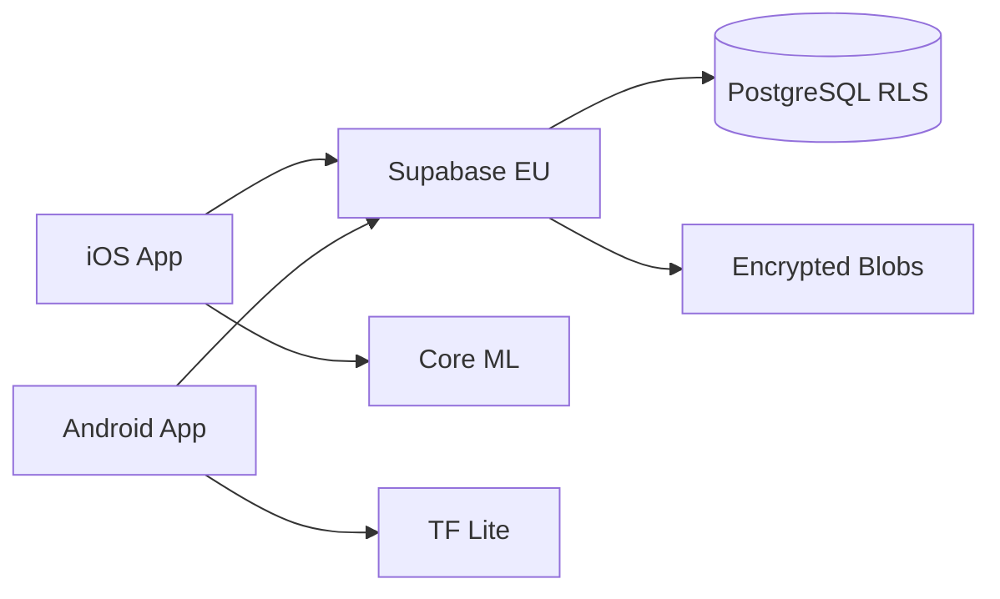

# ShifAI

**Ton cycle, ton intelligence.** — Privacy-first menstrual health tracking with on-device AI.

[](https://github.com/your-org/shifai/actions)

---

## 🏗 Architecture

```
shifai-ios/          SwiftUI · iOS 17+ · Swift 5.9
shifai-android/      Jetpack Compose · Android 8+ · Kotlin 2.0
shifai-backend/      Supabase (EU) · Edge Functions · PostgreSQL
```



## 🔒 Security — Zero-Knowledge

| Layer | Technology |
|-------|-----------|
| At-rest | AES-256-GCM + SQLCipher |
| In-transit | TLS 1.3 + Certificate Pinning |
| Keys | Keychain (iOS) / Keystore (Android) |
| Backend | Zero-knowledge — server never sees plaintext |
| Auth | Biometric + PIN fallback |
| Hosting | EU-only (eu-west-1) |

## 📱 Features

- **Cycle Tracking** — period, symptoms (20+), body map, mood, energy, sleep, stress
- **On-Device AI** — pattern detection, cycle predictions, symptom correlations
- **Medical Export** — PDF reports (SOPK, Endometriosis, Custom) for healthcare
- **Widgets** — iOS (4 sizes + Lock Screen) + Android (Glance + Material You)
- **Sync** — encrypted cloud backup with conflict resolution
- **Smart Notifications** — anti-spam (1/day, quiet hours, auto-stop)
- **GDPR** — full data export (CSV), account deletion, privacy dashboard

## 🚀 Getting Started

### iOS

```bash
cd shifai-ios
open ShifAI.xcodeproj
# Select iPhone 15 simulator → Run
```

### Android

```bash
cd shifai-android
# Create local.properties with:
# SUPABASE_URL=https://your-project.supabase.co
# SUPABASE_ANON_KEY=your-anon-key
./gradlew assembleDebug
```

### Backend

```bash
cd shifai-backend
npx supabase start   # local dev
npx supabase db push # run migrations
npx supabase functions serve  # Edge Functions
```

## 🧪 Tests

```bash
# iOS
xcodebuild test -scheme ShifAI -destination 'platform=iOS Simulator,name=iPhone 15'

# Android
cd shifai-android && ./gradlew testDebugUnitTest
```

**63 unit tests** covering encryption, pattern detection, notifications, sync, analytics, and performance monitoring.

## 📂 Project Structure

```
shifai-ios/ShifAI/
├── App/                  Entry point, navigation
├── Presentation/         SwiftUI views (Dashboard, Tracking, Insights, Export, Settings)
├── Domain/               Business logic (PatternDetection, ML, QuickWins)
├── Data/                 Encryption, Database (GRDB), Repositories
├── Infrastructure/       Analytics, Performance, Accessibility
└── Widget/               WidgetKit extensions

shifai-android/app/src/main/java/com/shifai/
├── presentation/         Compose screens + navigation
├── domain/               Intelligence engines
├── data/                 Encryption, Room DB, sync
└── infrastructure/       Analytics, monitoring

shifai-backend/supabase/
├── migrations/           SQL schema (RLS + encryption)
└── functions/            Edge Functions (sync, share, delete, cleanup)
```

## 📊 Stats

| Metric | Value |
|--------|-------|
| Total files | 100+ |
| Lines of code | 18,000+ |
| Unit tests | 63 |
| iOS screens | 6 + widgets |
| Android screens | 6 + widgets |
| Edge Functions | 4 |
| DB Migrations | 2 |
| Localization keys | 130+ (FR) |

## 📜 License

Proprietary. All rights reserved.
